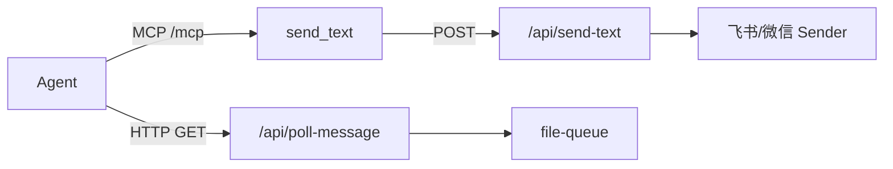

# HTTP 与 MCP 服务

## 一、能力范围

Daemon 内 HTTP Server（`src/daemon.ts` `startHttpServer`）与两套 StreamableHTTP MCP：`/mcp`（Agent 通信）、`/mcp-admin`（自管理）。含消息 poll/send、队列、通道绑定、管理 CRUD API。

## 二、设计决策与取舍

- **StreamableHTTP 每请求新建 McpServer**：简化会话，连接关闭即释放（依据：daemon.ts `/mcp` handler）。
- **Agent MCP 工具转调本地 HTTP**：`send_text` 等内部 POST `/api/send-text`，避免重复实现发送逻辑。
- **manage_* 在 server-admin.ts 注册**：通过 lock 文件读 port，HTTP 调 Daemon 管理路由（依据：`src/server-admin.ts`）。
- **poll 双模式**（依据：`src/daemon.ts` `/api/poll-message`）：
  - **`wait=false` / `wait=0`（非阻塞）**：立即 `claimSessionMessages` 并返回 `{ messages }`；无消息则空数组。SDK 保活规则用此模式 + Shell `sleep 5` 短循环，避免单次长挂起触发 Run 超时。
  - **默认 blocking（无 wait 或 wait≠false）**：长连接挂起最多 **25 分钟**；超时且无新消息时返回 **SYSTEM OVERRIDE** 占位指令，驱动 Agent 再次 blocking poll。CLI/legacy 保活仍可用此路径。

## 三、服务端规则

- 群聊须 @ 机器人才入队；armed-bind 私聊绑定主用户。
- ack 删队列；DONE 表情延迟到下次 poll。
- 斜杠指令写 `.fcmd`，60s 超时。

## 四、客户端流程

## 五、接口

### MCP Agent 工具（`/mcp`）

| 工具 | 关键参数 | 说明 |
|---|---|---|
| send_text | text, message_id?, session_key? | 文本回复 |
| send_image | image_path, message_id?, session_key? | 发图 |
| send_file | file_path, message_id?, session_key? | 发文件 |
### MCP Admin 工具（`/mcp-admin`）

| 工具 | action | 说明 |
|---|---|---|
| manage_agent | status/stop/restart/reset/clean/launch | Agent 与队列 |
| manage_mcp | list/add/delete | ~/.cursor 与项目 mcp.json |
| manage_rules | list/read/save/delete | 项目 rules |
| manage_skills | list/read/save/delete | ~/.cursor/skills |
| manage_tasks | list/add/update/delete/toggle | scheduled-tasks.json |
| manage_workspace | get/set | 工作目录 |

### HTTP 路由（节选）

| 方法 | 路径 | 说明 |
|---|---|---|
| GET | /health | 健康检查 |
| GET | /api/poll-message | 拉消息；`wait=false` 非阻塞即时返回，默认 blocking 最长 25min 可返 SYSTEM OVERRIDE |
| POST | /enqueue | 入队 |
| POST | /channel-bind | 绑定 |
| GET/POST | /api/mcp 等 | 管理 CRUD |
| POST | /shutdown | 退出 |

## 六、数据

- 队列文件：`.qmsg/.claimed/.done`（file-queue 模块目录 under APP_DATA_DIR）。
- 活跃会话：`activeSessionMap` chatId → sessionKey（内存）。
- 定时任务：`{APP_DATA_DIR}/scheduled-tasks.json`。

## 七、非功能与可观测

- blocking poll 最长 25min 后 SYSTEM OVERRIDE；非阻塞 poll 无长连接；SSE `/api/queue-events`。
- MCP 连接数影响 agentRunning。

## 八、推送

SSE 队列事件；stdout 特殊行 `__WECHAT_QR__`、`__BIND_RESULT__` 供 Electron 解析。

## 九、已知限制与 TODO

- manage_* 依赖 Daemon 已启动且 lock.port 可读。
- HTTP 404 统一 `{ error: "not found" }`。

## 十、变更记录

- 2026-06-27：poll `wait=false` 与 blocking SYSTEM OVERRIDE 适用场景（SDK 保活兼容）
- 2026-06-27：kb-sync 初始建立
