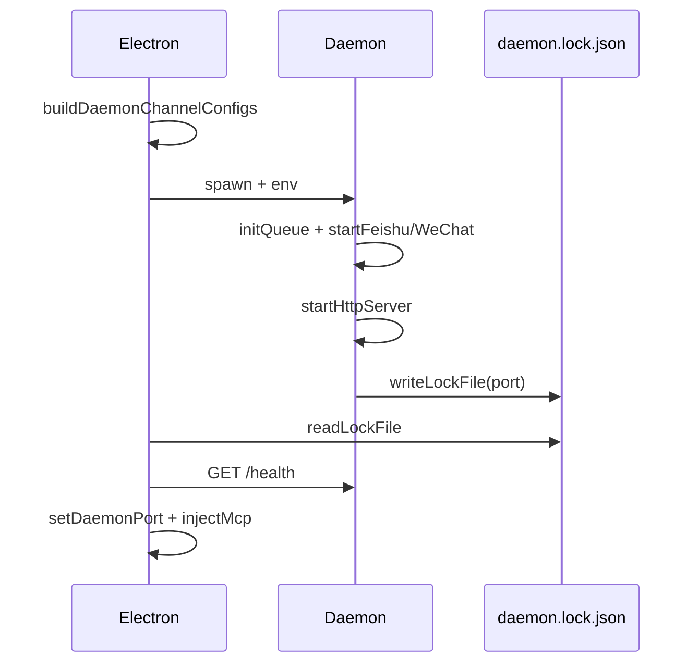

# 进程模型与部署

## 一、能力范围

Daemon 的启动入口、Electron spawn 方式、环境变量、端口与锁文件、日志、与主进程 stdout 协议通信。不含业务消息解析细节。

## 二、设计决策与取舍

- **Electron 作为 Node 运行时**：`spawn(process.execPath, [entryPath], { env: { ELECTRON_RUN_AS_NODE: "1" } })`（依据：`electron/daemon-manager.ts`）。
- **bundle 单文件入口**：`scripts/bundle-daemon.cjs` 产出，`getDaemonEntryPath()` 定位（打包后在 resources）。
- **端口冲突回退**：`LARK_DAEMON_PORT` 占用则 listen(0) 随机（依据：`src/daemon.ts` tryListen）。
- **锁文件协调**：就绪后写 `daemon.lock.json`；Electron `readLockFile` 获 port 再 HTTP 通信。

## 三、服务端规则

- 至少一个启用通道写入 `CLAW_CHANNELS_JSON`。
- `APP_DATA_DIR` 与 Electron userData 一致，保证队列/锁/日志路径统一。
- 退出时 `removeLockFile`、停止 cron（`stopDaemonScheduledTasks`）。

## 四、客户端流程

### 环境变量

| 变量 | 来源 | 说明 |
|---|---|---|
| CLAW_CHANNELS_JSON | daemon-manager | 通道配置数组 |
| LARK_WORKSPACE_DIR | config.workspaceDir | 默认工作区 |
| APP_DATA_DIR | userData | 队列/锁/日志 |
| LARK_DAEMON_PORT | config.daemonPort | 期望端口 |
| CURSOR_CLAW_TEMPLATE_DIR | resources/template | 注入模板 |

### stdout 协议（Electron 解析）

| 前缀 | 含义 |
|---|---|
| `__IND_LAUNCH__:` | 独立/定时 Agent |
| `__BIND_RESULT__:` | 绑定成功 |
| `__WECHAT_QR__:` | 微信扫码 |

## 五、接口

Electron → Daemon：

| 调用 | 时机 |
|---|---|
| GET `http://127.0.0.1:{port}/health` | 等待就绪 |
| POST `/shutdown` | 停止或重启前 |
| POST `/channel-bind` | UI 绑定流程 |

## 六、数据

**daemon.lock.json**（`LOCK_FILE_NAME`，`src/shared/constants.ts`）：

字段：pid、port、version、startedAt、workspaceDir。日志 `{APP_DATA_DIR}/daemon.log`，2MB 轮转。

## 七、非功能与可观测

- **自愈**：非主动 stop 时 3s 延迟重启，60s 内最多 5 次。

## 八、推送

Daemon 不主动推 Electron；依赖 stdout 行与 HTTP 轮询（Electron statusInterval）。

## 九、已知限制与 TODO

- 孤儿 Daemon：Electron 启动前若 lock 存在会先 POST shutdown 清理。
- `npm run dev:mcp` 与桌面 spawn 路径不同。

## 十、变更记录

- 2026-06-27：kb-sync 初始建立
