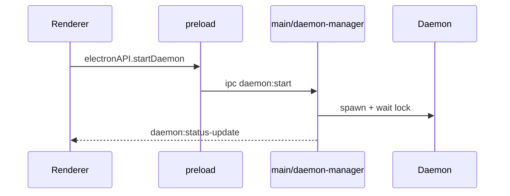

# 主进程与 IPC

## 一、能力范围

负责 Electron 主进程：窗口/托盘、IPC 注册、Daemon spawn 与状态轮询、MCP/Rules/Skills 文件操作、飞书/微信绑定辅助。不负责 Daemon 内 HTTP 路由实现。

## 二、设计决策与取舍

- **contextIsolation + preload 白名单**：安全隔离渲染进程，API 集中在 `electron/preload.ts` 的 `electronAPI`（依据：`electron/main.ts` webPreferences）。
- **Daemon 独立子进程**：消息长连接与 Agent poll 解耦 UI 线程；用 `ELECTRON_RUN_AS_NODE` 复用 Electron 内置 Node（依据：`electron/daemon-manager.ts` spawn）。
- **profile 隔离 userData**：多开互不干扰（依据：`electron/main.ts` `--profile=`）。
- **IPC 分文件注册**：`main.ts` 注册基础 handler；`daemon-manager`、`updater` 等模块按需 `ipcMain.handle`（依据：源码）。

## 三、服务端规则

无独立服务端；Daemon 规则见 Daemon 分区。主进程通过 HTTP 调用本机 Daemon（`electron/daemon-client.ts`）。

## 四、客户端流程

关闭窗口：`closeWindowAction` 为 ask/minimize/quit；ask 时主进程 `send window:close-confirm`，渲染层 `CloseWindowModal` 回传结果（`electron/main.ts`）。

## 五、接口

### IPC（main.ts 节选）

| channel | 作用 |
|---|---|
| `config:get` / `config:save` | 读写配置 |
| `daemon:start/stop/status/queue*` | Daemon 生命周期与队列 |
| `window:*` | 无边框窗口控制 |
| `mcp:*` / `rules:*` / `skills:*` | 本地 MCP 与 Cursor 资产 CRUD |
| `models:list` / `sdk:*` | CLI/SDK 模型 |

完整列表见 preload；扩展 handler 在 daemon-manager。

### Daemon HTTP（主进程调用）

| 方法 | 路径 | 用途 |
|---|---|---|
| POST | `/shutdown` | 停止 Daemon |
| POST | `/enqueue` | 向主会话入队 |
| GET | `/api/active-sessions` | 会话映射 |

## 六、数据

- 配置：`electron-store` 文件 `cursor-claw-config`（加密 key，见 config-store 分区）。
- Lock：`userData/daemon.lock.json`，字段 pid/port/version/workspaceDir。

## 七、非功能与可观测

- `broadcastLog` / `daemon:log` 推送 Daemon 与主进程日志到 Dashboard。
- `powerSaveBlocker` 在 Daemon 运行期阻止系统休眠（daemon-manager）。
- MCP CLI 调用 30s 超时（`electron/mcp-manager.ts`）。

## 八、推送

无服务端推送；主进程向渲染层 `webContents.send`：`daemon:status-update`、`bind:result`、`feishu:setup-qrcode` 等。

## 九、已知限制与 TODO

- 开发模式 Tray/Updater 行为与打包版不同。

## 十、变更记录

- 2026-06-27：kb-sync 初始建立
